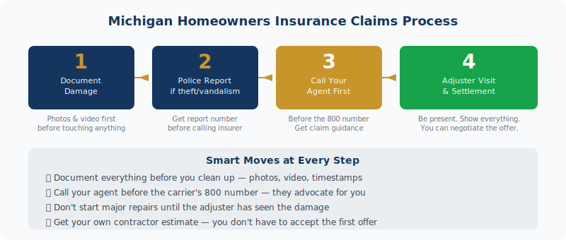

  Dealing with home damage in Michigan? Your JJA agent can guide you through the claims process. <a href="../../personal/home-insurance/" style="color:var(--navy);font-weight:600;">Contact a Michigan home insurance agent →</a>

A tree falls on your roof. Pipes burst in January. Someone breaks into your garage. What you do in the first 24 hours can make a real difference in how your claim gets processed — and how much you get paid. Here's exactly what to do — and what to avoid — when you need to file a homeowners insurance claim in Michigan.

<h2>Step 1: Secure the Property and Document Everything First</h2>

Before you touch anything, document the damage. Take photos and video of every affected area — wide shots for context, close-ups of specific damage. Walk through every room that was impacted. If your phone timestamps or geotags photos, use it. More documentation is always better than less.

Do not throw anything away before the adjuster sees it. That water-logged carpet, the broken window frame, the furniture that got ruined — your insurer needs to see the damage to compensate you for it. Cleaning up before the adjuster visits is one of the most common mistakes Michigan homeowners make after a loss.

If the damage makes your home unsafe, take emergency steps to stabilize it. Cover a hole in the roof with a tarp. Board up a broken window. Call an emergency plumber to stop a burst pipe. This isn't just smart — your policy requires you to take reasonable steps to prevent additional damage after a covered loss. Document these emergency repairs too.

<h2>Step 2: File a Police Report When Required</h2>

If your claim involves theft, burglary, or vandalism, call the police before you call your insurance company. File a report and get the report number — you'll need it when you submit your claim. Without a police report, theft claims are significantly harder to process and easier for insurers to dispute.

For weather damage, fire, water damage from burst pipes, or accidental damage, a police report isn't necessary. Skip this step for those scenarios and go straight to your insurer.

<h2>Step 3: Call Your Agent Before the Insurance Company's 800 Number</h2>

<figure style="margin:1.5rem 0 2rem;">
  
  <figcaption style="font-size:.8rem;color:var(--text-muted);margin-top:.5rem;text-align:center;">The Michigan homeowners insurance claims process, step by step</figcaption>
</figure>

Your agent knows your policy, your insurer's internal processes, and how to get things moving. Calling your agent first — not the generic 1-800 number — gives you real advantages:

<ul>
  <li>Your agent can review your policy and tell you upfront whether the claim is likely to be covered</li>
  <li>They can advise you on whether the claim is worth filing, or whether paying out of pocket makes more sense given your deductible and rate history</li>
  <li>They'll know what documentation the specific insurer needs and flag issues before they become disputes</li>
  <li>If your claim gets pushed back, your agent can advocate on your behalf in ways you can't easily do yourself</li>
</ul>

Not every claim is worth filing. If the damage is $800 and your deductible is $1,000, you're paying out of pocket anyway — and filing the claim creates a record that can affect your renewal rate. A two-minute call to your agent can help you make that call intelligently.

<h2>Step 4: The Adjuster Inspection — What to Know</h2>

The adjuster's job is to assess the damage and assign a dollar figure. They work for the insurance company. That doesn't mean they're your adversary, but it does mean their initial estimate may not fully account for everything.

Be present for the inspection. Walk through every damaged area with the adjuster and point out everything. If you've already gotten your own contractor's estimate, have it ready. If the adjuster's estimate comes back lower than your contractor's, you have options: provide the contractor's estimate as a counteroffer, request a re-inspection, or ask your insurer to explain the discrepancy in writing.

You're not obligated to accept the first offer. Negotiating a claim isn't combative — it's normal. Most adjusters have some flexibility, especially when you have documentation and a competing estimate to back you up.

<h2>What Not to Do After a Home Insurance Loss</h2>

A few things Michigan homeowners commonly do that hurt their claims:

<ul>
  <li><strong>Starting major repairs before the adjuster visit.</strong> Emergency stabilization is fine and required. Full repairs before the adjuster sees the damage is a problem — you've destroyed the evidence they need to assess.</li>
  <li><strong>Throwing away damaged items.</strong> Hold everything until the adjuster clears it or you've photographed it thoroughly.</li>
  <li><strong>Assuming coverage without checking.</strong> A lot of homeowners assume flooding, sewer backup, and earthquake are covered. They're usually not under a standard policy. Call your agent first.</li>
  <li><strong>Accepting a settlement that doesn't cover the real cost.</strong> You're not required to accept the first offer. You can negotiate, get your own estimates, and push back.</li>
  <li><strong>Signing contractor assignments of benefits before the adjuster visits.</strong> Some contractors present paperwork that transfers your insurance rights to them. Read before you sign — this can remove your control over the claims process.</li>
</ul>

<figure style="margin:1.5rem 0 2rem;border-radius:12px;overflow:hidden;">
  <picture>
  <source srcset="../../assets/img/blog/photo-1720065609938-ec0e33ffd9ad.avif" type="image/avif">
  
</picture>
  <figcaption style="font-size:.8rem;color:var(--text-muted);margin-top:.5rem;text-align:center;">When the worst happens, how you handle the first 48 hours determines how quickly your claim moves. Photo: Unsplash</figcaption>
</figure>

<h2>Should You File Every Claim? Not Necessarily.</h2>

This is the question most homeowners don't think to ask. Filing a claim creates a record. Multiple claims in a short window — say, two or three claims in three years — can trigger rate increases or non-renewal in Michigan, even if each individual claim was small and legitimate.

The rule of thumb: if the damage is at or below your deductible, don't file — you're paying out of pocket anyway and generating a claims record. If the damage is meaningfully above your deductible, file. For damage in the middle zone — say, $500 over your deductible — call your agent and run through the math before deciding.

<h2>Frequently Asked Questions</h2>

  
How long does a homeowners insurance claim take in Michigan?

  

    
Simple claims — a broken window, minor theft — often resolve in 2–4 weeks once documentation is submitted. Complex losses involving structural damage, large theft claims, or coverage disputes can take considerably longer. The best thing you can do is keep your documentation tight, respond promptly to insurer requests, and have your agent push if things are stalling.

  

  
Does filing a homeowners claim raise my rates in Michigan?

  

    
It can. One claim rarely causes dramatic rate increases. Two or three claims in three years can trigger meaningful increases or non-renewal. Before filing, call your agent to assess whether the claim is worth it relative to your deductible and rate history. For small claims near your deductible, paying out of pocket is often the smarter long-term move.

  

  
Do I need a police report for a home insurance claim in Michigan?

  

    
Yes for theft, burglary, and vandalism — file the police report before calling your insurer. No for weather damage, fire, accidental damage, or pipe bursts. Get the report number and keep a copy for your claim file.

  

  
Can I use my own contractor for insurance repairs in Michigan?

  

    
In most cases, yes. Michigan law gives homeowners the right to use a licensed contractor of their choosing. Some policies have preferred vendor programs, but they're generally not mandatory. Be cautious about signing contractor paperwork that includes assignment of benefits language before the adjuster has assessed the damage.

  

  
What is a proof of loss and when do I need to submit it?

  

    
A proof of loss is a sworn statement detailing what was damaged and its value. Your insurer provides the form after you file the claim. Don't sit on it — submit it promptly once you receive it. Delays on your end slow down the entire claim. Your agent can help you fill it out correctly the first time so it doesn't come back with questions.

  

  

<h3 style="font-size:1rem;text-transform:uppercase;letter-spacing:.06em;color:var(--text-muted);margin-bottom:1rem;">Related Articles</h3>
<a href="../why-home-insurance-went-up-2026/" style="display:block;padding:1rem;border:1px solid var(--border);border-radius:var(--r-md);text-decoration:none;color:inherit;transition:border-color .2s;">Home Insurance
Why Did My Homeowners Insurance Go Up in 2026? (And 7 Ways to Fight Back)
</a><a href="../michigan-flood-insurance/" style="display:block;padding:1rem;border:1px solid var(--border);border-radius:var(--r-md);text-decoration:none;color:inherit;transition:border-color .2s;">Home Insurance
Flood Insurance in Michigan: What Your Homeowners Policy Doesn't Cover
</a><a href="../michigan-renters-insurance/" style="display:block;padding:1rem;border:1px solid var(--border);border-radius:var(--r-md);text-decoration:none;color:inherit;transition:border-color .2s;">Home Insurance
Michigan Renters Insurance: What It Covers, What It Costs, and Why You Probably Need It
</a>

