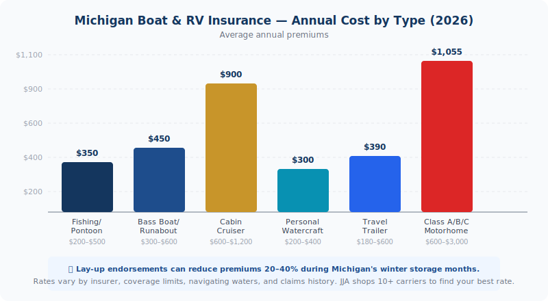

    <figure style="margin:0 0 2rem;border-radius:12px;overflow:hidden;"></figure>
    

  Michigan boat and RV season is here. <a href="../../personal/" style="color:var(--navy);font-weight:600;">Get a watercraft or RV insurance quote from JJA →</a>

Michigan gives you 11,000 inland lakes, hundreds of miles of Great Lakes shoreline, and some of the best camping in the Midwest. But the moment you pull out of the marina or hook that camper up to your truck, your standard homeowners and auto policies stop protecting you. Boat and RV insurance fills that gap — and in Michigan, there are rules that catch people off guard every single summer.

  
<strong>Michigan-specific rule:</strong> If your RV is a self-propelled motorhome or camper van, it's legally treated like a car. Michigan no-fault requirements apply — PIP, bodily injury liability, and property damage coverage are all mandatory. An uninsured motorhome cannot legally be driven on Michigan roads.

<h2>Does Michigan Require Boat Insurance?</h2>

Michigan doesn't legally require boat insurance the way it requires auto insurance. You can technically launch a boat without coverage. But that doesn't mean you should — and in practice, it often isn't optional.

If you financed your boat, your lender requires coverage. Full stop. Most marinas require liability insurance as a condition of docking. And if you cause an accident on the water — capsizing another boat, injuring a passenger, damaging a dock — you're personally liable for every dollar of damages.

There's also a coverage gap hiding in your homeowners policy. Most Michigan homeowners policies cover small watercraft — under 25 horsepower, under 26 feet — for basic liability. Once you're over those thresholds, that coverage disappears. And physical damage (the boat getting totaled) is almost never covered under homeowners regardless of size.

<h2>What Boat Insurance Covers</h2>

A standalone Michigan boat policy typically includes:

<ul>
  <li><strong>Physical damage</strong> — collision, storm damage, sinking, fire, theft</li>
  <li><strong>Liability</strong> — bodily injury and property damage you cause to others on the water</li>
  <li><strong>Uninsured/underinsured boater coverage</strong> — if someone without coverage hits you</li>
  <li><strong>Medical payments</strong> — for injuries to you and your passengers</li>
  <li><strong>Towing and salvage</strong> — emergency assistance if you break down on the water</li>
  <li><strong>Fishing equipment</strong> — rods, reels, tackle boxes as optional add-on coverage</li>
</ul>

What it doesn't cover: fuel spill cleanup (that's an add-on), racing, commercial use, or damage you cause intentionally.

<figure style="margin:1.5rem 0 2rem;border-radius:12px;overflow:hidden;">
  <picture>
  <source srcset="../../assets/img/blog/photo-1779078063955-8fbf934c358c.avif" type="image/avif">
  
</picture>
  <figcaption style="font-size:.8rem;color:var(--text-muted);margin-top:.5rem;text-align:center;">Michigan campgrounds fill up fast in summer. Whether you own a motorhome or pull a trailer, the right RV insurance keeps your trip on track. Photo: Unsplash</figcaption>
</figure>

<h2>What Does Michigan Boat Insurance Cost?</h2>

<figure style="margin:1.5rem 0 2rem;">
  
  <figcaption style="font-size:.8rem;color:var(--text-muted);margin-top:.5rem;text-align:center;">Average annual insurance costs by vessel type in Michigan (2026)</figcaption>
</figure>

Premiums depend on what you're insuring, where you navigate, and how much coverage you carry:

<ul>
  <li><strong>Fishing boats / pontoons:</strong> $200–$500/year</li>
  <li><strong>Bass boats / runabouts:</strong> $300–$600/year</li>
  <li><strong>Cabin cruisers / larger vessels:</strong> $600–$1,200+/year</li>
  <li><strong>Personal watercraft (jet skis):</strong> $200–$400/year</li>
</ul>

Boats used on the Great Lakes cost more than those on inland lakes — the exposure is higher, waves are bigger, and distances from shore are greater. High-performance boats and offshore racing models are in a separate category entirely.

One Michigan advantage: the short boating season. A lay-up endorsement (see below) can meaningfully reduce your premium by suspending coverage during winter storage.

<h2>RV Insurance in Michigan: What's Required vs. What's Smart</h2>

RV insurance in Michigan splits into two very different categories depending on what you're towing — or driving.

<strong>Self-propelled motorhomes (Class A, B, C) and camper vans</strong> are treated like motor vehicles under Michigan law. They require the same no-fault coverage as your car: PIP medical coverage, bodily injury liability ($50,000/$100,000 minimum), and property damage liability ($10,000 minimum). You cannot register a motorhome or legally drive it without this coverage.

<strong>Travel trailers, fifth wheels, and pop-up campers</strong> are towed — they don't move under their own power. However, if your trailer has two or more axles, Michigan requires registration and insurance before it can legally use Michigan roads. Your towing vehicle's auto policy may cover liability while towing, but physical damage to the trailer itself typically isn't covered under a standard auto policy.

Beyond the legal minimums, RV-specific policies add coverage your auto policy won't provide:

<ul>
  <li><strong>Total loss replacement</strong> — new-for-old if your RV is totaled in the first few years</li>
  <li><strong>Full-timer coverage</strong> — if your RV is your primary residence, standard policies won't cover it properly</li>
  <li><strong>Campsite/vacation liability</strong> — covers accidents at your campsite, not just on the road</li>
  <li><strong>Attached accessories</strong> — awnings, satellite dishes, solar panels, slide-outs</li>
  <li><strong>Emergency expense coverage</strong> — hotel and meals if you break down far from home</li>
</ul>

<h2>What RV Insurance Costs in Michigan</h2>

Michigan RV premiums are among the higher in the country due to no-fault requirements and seasonal storage costs, but the range is wide:

<ul>
  <li><strong>Travel trailers and 5th wheels:</strong> $180–$600/year</li>
  <li><strong>Class B and C motorhomes:</strong> $600–$1,400/year</li>
  <li><strong>Class A motorhomes:</strong> $1,000–$3,000/year</li>
</ul>

Progressive data for Michigan puts the average motorhome policy around $1,055 per year — less than most people expect for a vehicle worth $50,000–$200,000.

<h2>The Lay-Up Period: Michigan's Best Boat and RV Discount</h2>

Michigan boats and many RVs sit in storage from October through April — roughly half the year. A lay-up endorsement suspends your on-water or on-road liability and collision coverage during that window, while keeping comprehensive protection active for fire, theft, vandalism, and storm damage in storage.

The savings vary by insurer, but for a boat stored 5–6 months per year, a lay-up discount can reduce your annual premium by 20–40%. Ask about it specifically when shopping — not all agents bring it up automatically.

<h2>When Your Home and Auto Policies Stop Covering You</h2>

This is where Michigan boaters and RV owners get burned. Standard homeowners policies typically exclude:

<ul>
  <li>Boats over 25–26 HP or over 26 feet in length</li>
  <li>Outboard motors above certain horsepower thresholds</li>
  <li>Any watercraft on the Great Lakes or open water</li>
  <li>Physical damage to any watercraft (most policies)</li>
</ul>

And your standard auto policy covers your tow vehicle while it's driving — not the trailer it's pulling. The trailer's contents, physical structure, and any damage it causes while parked are outside auto policy territory.

The fix is straightforward: a standalone boat or RV policy that picks up where your other policies leave off. At JJA, we shop those across multiple carriers — pricing varies more than most people expect between insurers on recreational vehicles, so comparison shopping pays off here.

  
<strong>Quick tip:</strong> Bundle your boat or RV policy with your home and auto and you'll almost always get a multi-policy discount. One call to our office compares pricing across 10+ Michigan carriers simultaneously — you don't have to shop each one separately.

<h2>Frequently Asked Questions</h2>

  
Is boat insurance required in Michigan?

  

    
Michigan doesn't legally require boat insurance the way it requires auto insurance. However, if your boat is financed, your lender will require coverage. Most marinas also require liability insurance as a condition of docking. And without coverage, any accident on the water leaves you personally liable for all damages.

  

  
Does my homeowners insurance cover my boat?

  

    
Sometimes — for small boats only. Most Michigan homeowners policies cover watercraft under 25 horsepower for basic liability. Once you're over that threshold, you're outside standard homeowners coverage. Physical damage to the boat is almost never covered under homeowners, regardless of size. Check your dec page and call us if you're not sure where your coverage ends.

  

  
Do I need Michigan no-fault insurance on my RV?

  

    
Yes, if it's a self-propelled motorhome or camper van. Michigan treats motorhomes like motor vehicles — PIP, bodily injury liability, and property damage are all required. Travel trailers are different: if they have two or more axles, Michigan requires registration and insurance, but the coverage requirements differ from a motor vehicle policy.

  

  
What is a lay-up period and how does it save money?

  

    
A lay-up period suspends certain coverages — collision and liability — for the months your boat or RV is in storage. You keep comprehensive for fire, theft, and storm damage. In Michigan, where boats often sit from October through April, a lay-up endorsement can cut your premium by 20–40%. It's worth asking about specifically when you're getting a quote.

  

  
How much does boat insurance cost in Michigan?

  

    
Fishing boats and pontoons typically run $200–$500 per year. Runabouts and bass boats land in the $300–$600 range. Cabin cruisers and larger vessels can exceed $1,000 per year. Personal watercraft usually costs $200–$400 per year. Great Lakes navigation pushes rates higher than inland lakes due to the exposure involved. Call our office and we'll compare across multiple carriers — the range between insurers on recreational boats is wider than most people expect.

  

  

<h3 style="font-size:1rem;text-transform:uppercase;letter-spacing:.06em;color:var(--text-muted);margin-bottom:1rem;">Related Articles</h3>
<a href="../michigan-flood-insurance/" style="display:block;padding:1rem;border:1px solid var(--border);border-radius:var(--r-md);text-decoration:none;color:inherit;transition:border-color .2s;">Home Insurance
Flood Insurance in Michigan: What Your Homeowners Policy Doesn't Cover
</a><a href="../michigan-umbrella-insurance-who-needs-it/" style="display:block;padding:1rem;border:1px solid var(--border);border-radius:var(--r-md);text-decoration:none;color:inherit;transition:border-color .2s;">Personal Insurance
Michigan Umbrella Insurance: Who Needs It and What It Actually Costs
</a><a href="../michigan-motorcycle-insurance-terminology/" style="display:block;padding:1rem;border:1px solid var(--border);border-radius:var(--r-md);text-decoration:none;color:inherit;transition:border-color .2s;">Insurance Education
Michigan Motorcycle Insurance: The Complete Terminology Guide
</a>

