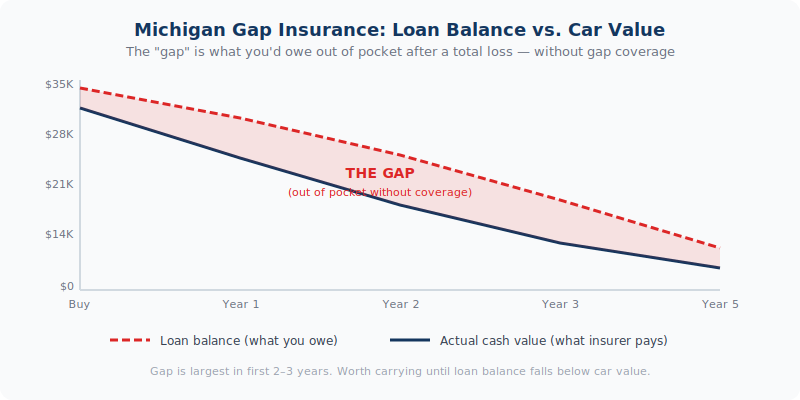

Adding a new vehicle to your Michigan policy? <a href="../../personal/auto-insurance/" style="color:var(--navy);font-weight:600;">Review your Michigan auto coverage →</a>

Your car gets totaled. Your insurance company pays you the vehicle&#39;s actual cash value — what it was worth the day of the accident. But you owe $4,000 more on the loan than that check covers. Gap insurance pays that difference. Without it, that $4,000 comes out of your pocket — for a car you can no longer drive.

<strong>Why it matters in Michigan:</strong> Vehicles depreciate the moment you drive off the lot — sometimes losing 15–20% of their value in the first year alone. Michigan&#39;s higher auto insurance costs also mean comprehensive and collision premiums are significant, and the actual cash value payout on a totaled vehicle can fall well short of what you still owe on a long-term loan.

<h2>How Gap Insurance Works</h2>
<figure style="margin:1.5rem 0 2rem;"><figcaption style="font-size:.8rem;color:var(--text-muted);margin-top:.5rem;text-align:center;">Michigan gap insurance — loan balance vs. actual cash value over time</figcaption></figure>

Your auto insurance policy&#39;s comprehensive and collision coverage pays the <strong>actual cash value (ACV)</strong> of your vehicle if it&#39;s totaled or stolen — meaning what the car is worth in the current market, accounting for depreciation, mileage, and condition. That number is often significantly lower than what you paid for the car, and it may be lower than what you still owe on your loan.

Gap insurance — Guaranteed Asset Protection — covers the difference between those two numbers. It pays off the remaining loan balance that your standard auto insurance won&#39;t cover, so you&#39;re not left making payments on a car you no longer have.

<h3>A straightforward example:</h3>
<table style="width:100%;border-collapse:collapse;margin:1rem 0 1.5rem;font-size:.97rem;">
  <tbody>
    <tr style="background:var(--bg-alt);"><td style="padding:.6rem 1rem;border:1px solid var(--border);font-weight:600;">Amount owed on loan</td><td style="padding:.6rem 1rem;border:1px solid var(--border);">$28,000</td></tr>
    <tr><td style="padding:.6rem 1rem;border:1px solid var(--border);font-weight:600;">Insurance ACV payout</td><td style="padding:.6rem 1rem;border:1px solid var(--border);">$23,500</td></tr>
    <tr style="background:var(--bg-alt);"><td style="padding:.6rem 1rem;border:1px solid var(--border);font-weight:600;">Gap — what you&#39;d owe out of pocket</td><td style="padding:.6rem 1rem;border:1px solid var(--border);">$4,500</td></tr>
    <tr><td style="padding:.6rem 1rem;border:1px solid var(--border);font-weight:600;">With gap insurance, you pay</td><td style="padding:.6rem 1rem;border:1px solid var(--border);font-weight:700;color:var(--navy);">$0</td></tr>
  </tbody>
</table>

<h2>When You Need Gap Insurance</h2>

Not every vehicle owner needs gap coverage. It&#39;s most valuable in specific situations where the loan balance is likely to exceed the vehicle&#39;s actual cash value:

<h3>You financed with a small down payment</h3>

If you put less than 20% down, you started the loan already "upside down" — owing more than the car was worth from day one. Depreciation makes that gap wider in the early years of the loan. Gap insurance is strongly worth carrying until you build enough equity that the loan balance drops below the vehicle&#39;s value.

<h3>You have a long loan term</h3>

60-month, 72-month, and 84-month auto loans are increasingly common in Michigan. The longer the loan, the slower you pay down the principal relative to how fast the vehicle depreciates. A 72-month loan on a new vehicle can leave you significantly underwater for the first two to three years.

<h3>You&#39;re leasing</h3>

Most lease agreements require gap coverage — and for good reason. Lease payments are calculated on the vehicle&#39;s depreciated value over the lease term, not on building equity. If the vehicle is totaled, you&#39;re responsible for the full remaining lease obligation. Gap insurance covers that gap between the ACV and what you owe on the lease.

<h3>You rolled negative equity from a previous loan</h3>

If you traded in a vehicle where you owed more than it was worth and rolled that balance into your new loan, you started the new loan already significantly underwater. Gap coverage is essentially mandatory in this situation.

<h3>You&#39;re financing a vehicle with rapid depreciation</h3>

Some vehicles — particularly certain luxury brands and trucks with high sticker prices — depreciate faster than average in the first year or two. The ACV drop on a $55,000 truck can be $8,000–$10,000 in year one alone.

<h2>When You Can Skip Gap Insurance</h2>

Gap insurance is not a one-size-fits-all product. There are situations where it doesn&#39;t make sense to pay for it:

<ul>
  <li><strong>You own the vehicle outright.</strong> No loan, no gap. If the car is paid off, there&#39;s nothing to cover.</li>
  <li><strong>You made a large down payment.</strong> If you put 30–40% down, your loan balance may already be below the vehicle&#39;s value. Run the numbers — if you&#39;re right-side-up on the loan, gap coverage adds no value.</li>
  <li><strong>Your loan balance is already lower than the vehicle&#39;s value.</strong> As you pay down the loan, the point comes where you owe less than the car is worth. At that point, cancel gap coverage — you no longer need it.</li>
  <li><strong>The vehicle is old or low in value.</strong> Gap insurance is designed for newer financed vehicles. On a vehicle worth $8,000 with a small remaining balance, the math rarely makes sense.</li>
</ul>

<h2>Where to Get Gap Insurance — and Why It Matters</h2>

Gap coverage can be purchased in a few different ways, and the cost varies significantly between them:

<h3>Through the dealership</h3>

Dealers typically offer gap insurance as a finance-and-insurance add-on when you buy the vehicle. It&#39;s convenient, but it&#39;s usually the most expensive option — often $400–$900 rolled into your loan, meaning you also pay interest on the gap coverage itself. Dealer gap products can also have limitations on coverage terms.

<h3>Through your auto insurance policy</h3>

Many auto insurance carriers offer gap coverage or a similar product called "loan/lease payoff coverage" as an endorsement on your existing policy. This is typically the most cost-effective option — often $20–$40 per year added to your policy premium. Coverage terms are usually clear and claims go through your existing insurer.

<h3>Through your lender or credit union</h3>

Banks and credit unions sometimes offer gap coverage at the time of financing. Pricing and terms vary — worth comparing against what your insurance carrier offers before committing.

<strong>Bottom line:</strong> If you&#39;re buying gap coverage, compare the dealer price against adding it to your auto insurance policy before you sign anything at the dealership. The difference in cost is often substantial. One call to our office before your vehicle purchase can save you several hundred dollars over the life of the coverage.

<h2>Frequently Asked Questions</h2>

  
Does Michigan require gap insurance?

  

    
Michigan law does not require gap insurance. However, your lender or leasing company may require it as a condition of financing or leasing. Even when it&#39;s not required, it&#39;s worth carrying any time your loan balance exceeds your vehicle&#39;s actual cash value.

  

  
When should I cancel gap insurance?

  

    
You can cancel gap coverage once your loan balance drops below your vehicle&#39;s current market value — meaning you&#39;re no longer "upside down." Use a vehicle valuation tool to check your car&#39;s current ACV against your remaining balance. Once you&#39;re right-side-up, gap coverage is no longer providing any benefit and you can remove it. If you bought gap through your auto insurance policy, it&#39;s easy to drop — just call us.

  

  
Does gap insurance cover my deductible?

  

    
Standard gap insurance does not cover your collision or comprehensive deductible — that still comes out of your pocket. Some gap products offer a deductible waiver as an add-on. If that matters to you, ask specifically whether the gap product you&#39;re considering includes deductible coverage before purchasing.

  

  
What happens if my car is stolen — does gap insurance cover that too?

  

    
Yes. Gap insurance applies to both total losses and theft — any situation where your comprehensive or collision coverage pays an ACV settlement that&#39;s less than your loan balance. If your vehicle is stolen and not recovered, your comprehensive coverage pays ACV, and gap insurance covers the remaining balance.

  

  
I bought gap at the dealership. Can I switch to a cheaper option?

  

    
Possibly. Some dealer-sold gap products allow cancellation for a prorated refund during the early portion of the coverage period. If you&#39;re within that window, it may be worth canceling the dealer product and adding a gap endorsement to your auto insurance policy at a lower annual cost. Check your dealer gap contract for cancellation terms, and call us to see what the insurance policy option would cost — the savings can be meaningful.

  

  

<h3 style="font-size:1rem;text-transform:uppercase;letter-spacing:.06em;color:var(--text-muted);margin-bottom:1rem;">Related Articles</h3>
<a href="../michigan-auto-insurance-glossary/" style="display:block;padding:1rem;border:1px solid var(--border);border-radius:var(--r-md);text-decoration:none;color:inherit;transition:border-color .2s;">Insurance Education
Michigan Auto Insurance Terminology Guide
</a><a href="../common-auto-insurance-terms/" style="display:block;padding:1rem;border:1px solid var(--border);border-radius:var(--r-md);text-decoration:none;color:inherit;transition:border-color .2s;">Auto Insurance
Common Michigan Auto Insurance Terms Explained for Drivers
</a><a href="../michigan-teen-driver-insurance/" style="display:block;padding:1rem;border:1px solid var(--border);border-radius:var(--r-md);text-decoration:none;color:inherit;transition:border-color .2s;">Auto Insurance
Adding a Teen Driver to Your Michigan Auto Policy: What Parents Need to Know
</a>

