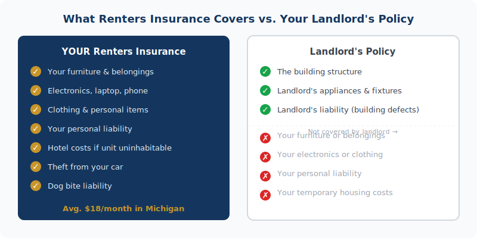

    <figure style="margin:0 0 2rem;border-radius:12px;overflow:hidden;"></figure>
    

  Michigan renters insurance starts at $15/month. <a href="../../personal/" style="color:var(--navy);font-weight:600;">Get a renters insurance quote from JJA →</a>

If you rent in Michigan and don't have renters insurance, you're one burst pipe, break-in, or kitchen fire away from replacing everything you own out of pocket. Your landlord's insurance covers the building. It covers the landlord's appliances and fixtures. It does not cover your couch, your laptop, your TV, or the cost of a hotel while your unit gets repaired. That's on you — unless you have a renters policy.

  
<strong>The math:</strong> Michigan renters insurance averages <strong>$18/month ($216/year)</strong>. For that, you get coverage on your personal belongings, up to $500,000 in liability protection, and additional living expenses if your unit becomes uninhabitable. That's less than most people spend on streaming services.

<h2>What Your Landlord's Policy Actually Covers</h2>

This is the misconception that costs Michigan renters thousands of dollars every year. When a pipe bursts and floods your apartment, your landlord's insurance covers the building — the walls, floors, structure, the landlord's appliances. It does not cover your furniture, your electronics, your clothing, or any of your personal property.

Your landlord isn't being stingy. That's how property insurance works. Their policy is designed to protect their investment in the building. Your belongings are your investment, and protecting them is your responsibility.

Same thing applies to liability. If someone slips and falls in your apartment and sues, your landlord's policy doesn't protect you. If you accidentally cause a fire that damages neighboring units, your landlord's policy covers the landlord's damages — your liability exposure is separate.

<figure style="margin:1.5rem 0 2rem;border-radius:12px;overflow:hidden;">
  <picture>
  <source srcset="../../assets/img/blog/photo-1613575831056-0acd5da8f085.avif" type="image/avif">
  
</picture>
  <figcaption style="font-size:.8rem;color:var(--text-muted);margin-top:.5rem;text-align:center;">Everything in this room is yours to protect. Your landlord's policy covers the building. Renters insurance covers everything inside. Photo: Unsplash</figcaption>
</figure>

<h2>What Renters Insurance Covers</h2>

<figure style="margin:1.5rem 0 2rem;">
  
  <figcaption style="font-size:.8rem;color:var(--text-muted);margin-top:.5rem;text-align:center;">Renters insurance vs. landlord's policy — who covers what</figcaption>
</figure>

A standard Michigan renters policy has three parts:

<strong>Personal property coverage</strong> protects your belongings from fire, smoke, theft, vandalism, windstorm, burst pipes, ice dam damage, and several other named perils. That includes:

<ul>
  <li>Furniture, electronics, appliances you own</li>
  <li>Clothing and jewelry (up to policy limits)</li>
  <li>Laptops, tablets, gaming systems</li>
  <li>Sports equipment and tools</li>
  <li>Property stolen from your <em>car</em> — yes, really (more on that below)</li>
</ul>

<strong>Personal liability coverage</strong> protects you if someone is injured in your unit or if you accidentally damage someone else's property. A guest trips on a rug and breaks their wrist — that's a liability claim. You're liable for your dog biting a neighbor — that's covered too. Standard policies include $100,000 in liability coverage, but you can go up to $500,000 — worth it if you have guests over regularly, own a dog, or simply want real peace of mind.

<strong>Additional living expenses (ALE)</strong> pay your hotel, meals, and temporary housing costs if your unit becomes uninhabitable after a covered loss. A kitchen fire that displaces you for three weeks costs real money. ALE covers that gap.

<h2>What Renters Insurance Doesn't Cover</h2>

A few things Michigan renters often assume are covered but aren't:

<ul>
  <li><strong>Flooding</strong> — water coming in from outside (heavy rain, overflowing river) is not a covered peril under standard renters insurance. You need separate flood coverage for that.</li>
  <li><strong>Earthquake</strong> — rare in Michigan but excluded nonetheless</li>
  <li><strong>Your roommate's stuff</strong> — unless they're listed on the policy, their belongings aren't covered</li>
  <li><strong>Business property above the policy sub-limit</strong> — if you run a business from home, coverage for business equipment is capped</li>
  <li><strong>High-value items above sub-limits</strong> — jewelry, art, and collectibles often have per-item limits; a scheduled endorsement covers the rest</li>
</ul>

<h2>How Much Does Renters Insurance Cost in Michigan?</h2>

Michigan renters insurance is affordable — and getting more so relative to what it covers, even though rates have climbed:

<ul>
  <li><strong>State average:</strong> $216/year ($18/month)</li>
  <li><strong>Detroit:</strong> approximately $342/year — highest in the state</li>
  <li><strong>Ann Arbor:</strong> approximately $173/year — lowest in the state</li>
  <li><strong>Grand Rapids, Lansing, Flint:</strong> typically $180–$240/year</li>
</ul>

Rates increased 5.8% in 2024 and another 6.6% in 2025 — Michigan is tracking above the national average on renters insurance inflation. Even so, $18/month to protect $25,000 in belongings is still a strong value proposition.

<h2>Actual Cash Value vs. Replacement Cost: This Decision Matters</h2>

When you buy renters insurance, you'll choose between two types of personal property coverage:

<strong>Actual cash value (ACV)</strong> pays what your belongings are worth <em>today</em>, factoring in depreciation. Your 3-year-old MacBook is worth maybe $400 on the used market. If it's stolen, ACV pays you $400.

<strong>Replacement cost coverage</strong> pays what it costs to replace the item with something comparable and new. That same MacBook costs $1,300 new. Replacement cost pays $1,300.

The premium difference between ACV and replacement cost renters insurance is usually $5–$15 per month. The payout difference after a real claim can be thousands. Always choose replacement cost.

<h2>Michigan-Specific Risks Worth Understanding</h2>

A few perils hit Michigan renters harder than the national average:

<strong>Burst pipes.</strong> Michigan winters push temperatures well below zero. If heat in your building fails while you're traveling — or if your unit is in a poorly insulated structure — pipes freeze and burst. Your renters policy covers the resulting water damage to your belongings. The building damage is the landlord's problem.

<strong>Ice dams.</strong> Ice dams form when heat escapes through a roof, melts snow, and refreezes at the eaves. The backed-up water works its way under shingles and into the building. If you're on an upper floor, this can damage your belongings. Covered under renters insurance as a water damage peril.

<strong>Tornadoes.</strong> Michigan averages 15–17 tornadoes per year. Most are weak EF0 or EF1 events, but they cause real damage. Windstorm is a covered peril under standard renters insurance — your belongings damaged in a tornado are covered.

<strong>Theft from your car.</strong> This one surprises people. Personal property stolen from your vehicle is typically covered under your renters policy — not your auto policy. So your laptop bag taken from your car in a parking lot is a renters insurance claim.

<h2>How Much Coverage Do You Actually Need?</h2>

Walk through your apartment and add up what it would cost to replace everything — not what you paid, but what it costs new today. Most renters underestimate badly. A modest one-bedroom adds up fast:

<ul>
  <li>Living room furniture + TV: $3,000–$5,000</li>
  <li>Bedroom furniture + bedding: $2,000–$4,000</li>
  <li>Laptop, tablet, phone: $2,500–$4,000</li>
  <li>Kitchen items + appliances: $1,000–$3,000</li>
  <li>Clothing: $3,000–$8,000</li>
  <li>Miscellaneous tools, sports gear, accessories: $1,000–$3,000</li>
</ul>

That's $12,500–$27,000 on the conservative end. Most people think they have $10,000 in stuff and actually have $25,000. Insure what you'd actually need to replace.

  
<strong>Pro move:</strong> Take a video walkthrough of every room in your apartment and store it in cloud storage. If you ever file a claim, that footage is invaluable documentation of what you owned. Takes 10 minutes; worth thousands.

<h2>Frequently Asked Questions</h2>

  
Does Michigan law require renters insurance?

  

    
No state law requires it. But your lease might — and many Michigan landlords make it a lease condition. Even when it's not required, going without it means your belongings, your liability exposure, and your temporary housing costs are entirely unprotected. For $18/month, the coverage is worth it.

  

  
Does renters insurance cover theft from my car?

  

    
Usually yes. Personal property stolen from your vehicle is typically covered under your renters policy's personal property section, subject to your deductible. This surprises a lot of Michigan renters — your laptop stolen from a parking lot goes through renters insurance, not auto insurance.

  

  
Does renters insurance cover flooding?

  

    
No. Standard renters insurance doesn't cover flood damage. Water coming in from outside — a storm surge, an overflowing river, heavy rainfall — is excluded. If you're in a flood-prone area of Michigan, you'd need a separate NFIP or private flood policy to cover your belongings against that specific risk.

  

  
What's the difference between actual cash value and replacement cost?

  

    
ACV pays what your items are worth today after depreciation. Replacement cost pays what it costs to buy comparable new items. The premium difference is usually $5–$15/month. The claim payout difference can be thousands of dollars. Choose replacement cost if it's available — it almost always is.

  

  
How much personal property coverage do I need?

  

    
More than most renters expect. Walk through your apartment and estimate replacement cost on everything — furniture, electronics, clothing, kitchen gear, sports equipment. A modest one-bedroom in Michigan can easily total $20,000–$35,000. Most renters pick $15,000 and find out after a fire or theft that they were underinsured. We can help you build a quick inventory to get to the right number.

  

  

<h3 style="font-size:1rem;text-transform:uppercase;letter-spacing:.06em;color:var(--text-muted);margin-bottom:1rem;">Related Articles</h3>
<a href="../why-home-insurance-went-up-2026/" style="display:block;padding:1rem;border:1px solid var(--border);border-radius:var(--r-md);text-decoration:none;color:inherit;transition:border-color .2s;">Home Insurance
Why Did My Homeowners Insurance Go Up in 2026? (And 7 Ways to Fight Back)
</a><a href="../michigan-homeowners-insurance-glossary/" style="display:block;padding:1rem;border:1px solid var(--border);border-radius:var(--r-md);text-decoration:none;color:inherit;transition:border-color .2s;">Insurance Education
Michigan Homeowners Insurance Terminology Guide
</a><a href="../how-to-file-homeowners-insurance-claim-michigan/" style="display:block;padding:1rem;border:1px solid var(--border);border-radius:var(--r-md);text-decoration:none;color:inherit;transition:border-color .2s;">Home Insurance
How to File a Homeowners Insurance Claim in Michigan: A Step-by-Step Guide
</a>

