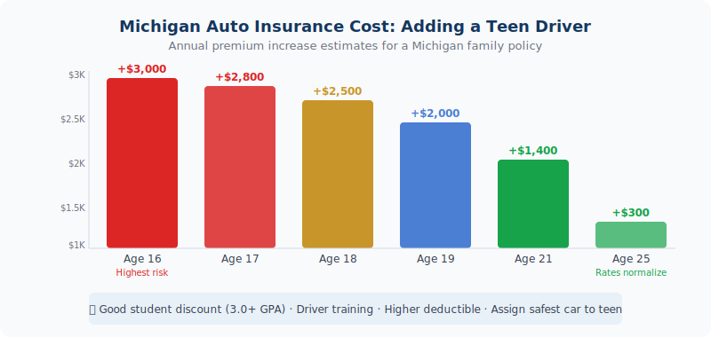

Adding a teen driver in Michigan? Let us shop 10+ carriers to find your best rate. <a href="../../personal/auto-insurance/" style="color:var(--navy);font-weight:600;">Get a free auto insurance quote →</a>

The moment your teenager gets their license is equal parts exciting and expensive. Adding a teen driver to a Michigan auto policy typically increases your annual premium by <strong>$2,500 or more</strong> — and that number reflects real risk, not arbitrary pricing. Here&#39;s what&#39;s behind the cost, which discounts are genuinely worth pursuing, and how to make sure your family is fully protected without overpaying.

<strong>By the numbers:</strong> Teen drivers (ages 16–19) are nearly <strong>3 times more likely</strong> to be in a fatal crash than drivers 20 and older. Michigan&#39;s combination of no-fault insurance laws and high underlying rates makes adding a teen here more expensive than in most states. That $2,500+ annual increase is the insurance industry pricing in the reality of inexperience behind the wheel.

<h2>Why Does Michigan Specifically Cost So Much?</h2>

Michigan already has some of the highest auto insurance rates in the country. When you add a teenager to an already-expensive policy, the numbers climb fast. A few factors make Michigan particularly expensive for teen drivers:

<strong>No-fault system costs:</strong> Michigan&#39;s no-fault insurance structure — even after the 2019 reforms — carries higher base costs than most states. Those underlying costs amplify the teen surcharge.

<strong>Urban density and traffic patterns:</strong> Southeast Michigan&#39;s metro corridors, where many JJA clients live and drive, have higher accident frequency than rural areas. Higher claim frequency in a zip code means higher rates for everyone in it.

<strong>Teen-specific risk multiplier:</strong> The statistical driving record for 16–19 year olds is genuinely worse. They&#39;re more likely to speed, more likely to be distracted, and less likely to recognize hazardous conditions. Insurers price this directly.

<h2>How Your Rate Is Calculated When You Add a Teen</h2>
<figure style="margin:1.5rem 0 2rem;"><figcaption style="font-size:.8rem;color:var(--text-muted);margin-top:.5rem;text-align:center;">Michigan auto insurance cost increase by teen driver age (annual estimates)</figcaption></figure>

When your teen gets their license, your insurer will re-rate your entire policy with the new driver included. Several factors go into what they charge:

<ul>
  <li><strong>Age:</strong> 16-year-olds are the most expensive. Rates drop incrementally through age 25.</li>
  <li><strong>Gender:</strong> Michigan law prohibits insurers from using gender as a rating factor — your teen&#39;s rate won&#39;t be higher because they&#39;re male.</li>
  <li><strong>Vehicle assigned:</strong> Which car your teen drives matters enormously. An older sedan costs far less to insure than a newer SUV or performance vehicle.</li>
  <li><strong>Their driving record:</strong> A clean record for the first few years helps. Any tickets or at-fault accidents spike the rate significantly.</li>
  <li><strong>Your existing policy:</strong> Teens added to policies with strong coverage history — long tenure, no recent claims — often get better rates than a brand-new policy.</li>
</ul>

<h2>What Actually Lowers the Cost</h2>

Not all discounts are created equal. Here are the ones that genuinely move the needle in Michigan:

<h3>Good Student Discount</h3>

A GPA of 3.0 or above (B average) typically qualifies for a good student discount — usually <strong>10–15% off</strong> the teen&#39;s portion of the premium. This is one of the most consistently available discounts across carriers. Submit report cards or transcripts when your teen qualifies, and keep it updated each semester.

<h3>Driver&#39;s Education Completion</h3>

Michigan requires completion of an approved driver&#39;s education program before teens under 18 can get a full license. Many carriers offer a discount specifically for completing an accredited program. Some offer an additional discount for defensive driving courses taken above and beyond the requirement.

<h3>Telematics / Usage-Based Programs</h3>

Programs like Progressive&#39;s Snapshot, Travelers&#39; IntelliDrive, or similar monitor driving behavior — speed, hard braking, time of day, phone usage. If your teen is actually a careful driver, these programs can produce significant discounts — sometimes 20–30% off. They require consent to data monitoring, which is a tradeoff worth evaluating based on your teen&#39;s driving habits.

<h3>Assigning the Right Vehicle</h3>

If you have multiple cars, assigning your teen to the oldest, lowest-value vehicle on the policy reduces the collision and comprehensive component significantly. A 2014 sedan with 100,000 miles on it is dramatically cheaper to insure for a teen than your 2023 SUV.

<h3>Bundling and Policy Tenure</h3>

Long-standing customers with bundled home and auto often receive better overall rates. If you&#39;ve been loyal to your current insurer for years with no claims, that tenure discount can soften the teen addition. If you&#39;re not bundled, it&#39;s worth looking at the combined home/auto picture when you add a teen — the overall math might make a switch worthwhile.

<strong>One call does it all:</strong> When your teen gets licensed, don&#39;t just accept your current insurer&#39;s re-rated premium. Call us. We&#39;ll re-quote your full policy across multiple carriers with the teen included and show you whether staying or switching saves more money. The difference between carriers can be hundreds of dollars a year — and that gap only grows with a teen on the policy.

<h2>Coverage Considerations You Shouldn&#39;t Skip</h2>

Adding a teen is the right time to review whether your coverage levels still make sense.

<h3>Should you lower coverage to save money?</h3>

It&#39;s tempting, but risky. Teen drivers are more likely to cause an accident, which is exactly when you need adequate liability limits. If your teen causes a serious injury and your liability limits are too low, the difference comes from your personal assets. This is actually the moment to consider whether an umbrella policy makes sense for your family — a $1 million umbrella adds meaningful protection for $400–$600 per year.

<h3>Collision and Comprehensive on their vehicle</h3>

If the car your teen drives is older and low in value, dropping collision and comprehensive might make financial sense. The general rule: if the car&#39;s value is less than 10 times the annual premium for those coverages, dropping them is worth considering. You&#39;d be paying more in premiums than you&#39;d collect in a total-loss claim.

<h3>Gap insurance — if they&#39;re driving a financed vehicle</h3>

If your teen drives a newer vehicle that&#39;s being financed, gap insurance protects you if it&#39;s totaled and you owe more than the car&#39;s actual cash value. Michigan&#39;s depreciation curve is steep enough that gap coverage is worth carrying for the first few years of any financed vehicle.

<h2>What Happens if Your Teen Gets a Ticket</h2>

In Michigan, a teen driver who receives a moving violation will likely trigger a surcharge on the policy at renewal. Depending on the violation and the carrier, that surcharge can add another $500–$1,000+ per year on top of the existing teen premium. At-fault accidents are even more costly.

If a violation does happen, call us before the renewal date. Some carriers are more forgiving than others on first offenses, and shopping the market after a teen&#39;s first ticket — before they accumulate more — can still produce a reasonable rate.

<h2>Frequently Asked Questions</h2>

  
Do I have to add my teen to my policy as soon as they get their license?

  

    
Yes — once your teen is licensed and driving your vehicles, you&#39;re legally obligated to list them as a driver. Failing to add them is considered a material misrepresentation on your policy, which can result in a denied claim. The financial exposure from an uncovered accident far outweighs the premium increase. Add them promptly and let us help you find the best rate.

  

  
Should my teen have their own separate policy?

  

    
In most cases, adding them to your policy is cheaper than a separate policy. Separate policies for teens are typically very expensive because they don&#39;t benefit from your multi-car discount, your tenure discount, or your bundling credits. The exception might be if your teen owns their own vehicle outright — but even then, we&#39;d run the numbers both ways before recommending a split.

  

  
What&#39;s the best car for a teen to drive from an insurance standpoint?

  

    
Older, lower-value sedans with good safety ratings cost the least to insure. High safety scores mean lower bodily injury risk; low vehicle value means less collision and comprehensive exposure. Sports cars, performance vehicles, and newer high-value SUVs are the most expensive categories. If you&#39;re buying a car specifically for your teen, run the insurance numbers before you commit — the cost difference between vehicles can easily be $800–$1,500 per year.

  

  
When does the teen driver surcharge come off my policy?

  

    
The high-risk teen rate typically starts declining around age 19–20 and improves through age 25. A clean driving record accelerates the improvement. At 25, most carriers move young drivers to standard adult rating, assuming no significant violations or at-fault accidents. Good student discounts, safe driving programs, and annual carrier shopping all help compress the cost during those years.

  

  
Can we use telematics monitoring programs to lower our rate?

  

    
Yes — for genuinely cautious teen drivers they can deliver real savings, sometimes 20% or more. The tradeoff is monitoring of driving behavior including time of day, speed, and hard braking. If your teen drives carefully and mostly during lower-risk hours, these programs are worth enrolling in. We can show you which carriers have the best telematics programs available in Michigan.

  

  

<h3 style="font-size:1rem;text-transform:uppercase;letter-spacing:.06em;color:var(--text-muted);margin-bottom:1rem;">Related Articles</h3>
<a href="../michigan-auto-insurance-glossary/" style="display:block;padding:1rem;border:1px solid var(--border);border-radius:var(--r-md);text-decoration:none;color:inherit;transition:border-color .2s;">Insurance Education
Michigan Auto Insurance Terminology Guide
</a><a href="../michigan-gap-insurance/" style="display:block;padding:1rem;border:1px solid var(--border);border-radius:var(--r-md);text-decoration:none;color:inherit;transition:border-color .2s;">Auto Insurance
Gap Insurance in Michigan: What It Is and When You Actually Need It
</a><a href="../common-auto-insurance-terms/" style="display:block;padding:1rem;border:1px solid var(--border);border-radius:var(--r-md);text-decoration:none;color:inherit;transition:border-color .2s;">Auto Insurance
Common Michigan Auto Insurance Terms Explained for Drivers
</a>

