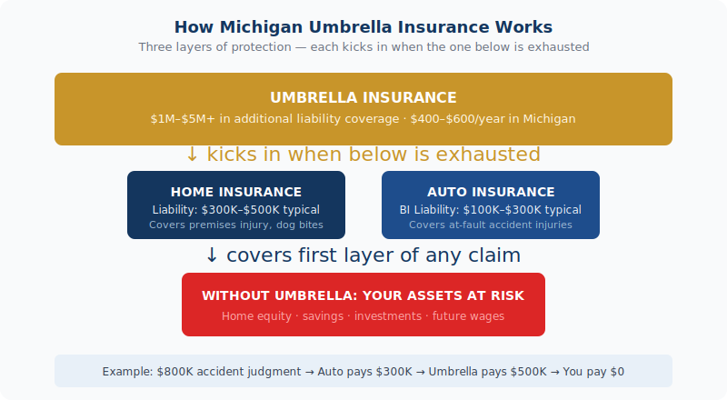

    <figure style="margin:0 0 2rem;border-radius:12px;overflow:hidden;"><picture><source srcset="../../assets/img/blog/photo-1562564055-71e051d33c19.avif" type="image/avif"></picture></figure>
    

Michigan umbrella policies start at $400–$600/year. <a href="../../personal/" style="color:var(--navy);font-weight:600;">Talk to a Michigan agent about umbrella coverage →</a>

For about the cost of a nice dinner out each month, you can add $1 million in liability protection on top of your existing home and auto coverage. Michigan umbrella insurance is one of the most underutilized policies out there — and for most homeowners with any real assets, it&#39;s also one of the smartest buys you can make.

<strong>Quick take:</strong> Umbrella insurance in Michigan currently runs <strong>$400 to $600 per year</strong> for $1 million in coverage. That works out to roughly $33–$50 a month to protect your home, savings, and future income from a lawsuit that exceeds your standard policy limits.

<h2>What Umbrella Insurance Actually Does</h2>
<figure style="margin:1.5rem 0 2rem;"><figcaption style="font-size:.8rem;color:var(--text-muted);margin-top:.5rem;text-align:center;">How Michigan umbrella insurance layers over your home and auto coverage</figcaption></figure>

Your homeowners policy has a liability limit — typically $300,000 to $500,000. Your auto policy has one too. Umbrella insurance sits above those limits and kicks in when a claim exceeds what your underlying policies will pay.

Think of it as a safety net for the scenarios your regular coverage wasn&#39;t built to handle. Someone slips on your icy front walk and sues for $600,000. You&#39;re found at fault in a serious car accident and the injured party&#39;s medical bills are $800,000. A neighbor&#39;s kid is injured at your home and the lawsuit lands at $1.2 million. Without an umbrella policy, anything above your base liability limits comes straight out of your pocket — your savings, your home equity, your wages.

With an umbrella policy, your insurer covers the gap. The $1 million (or more) in additional coverage handles it instead.

<h2>What Umbrella Insurance Covers</h2>

<ul>
  <li><strong>Auto accidents</strong> — bodily injury and property damage claims that exceed your auto policy limits</li>
  <li><strong>Premises liability</strong> — injuries that occur on your property (slip-and-fall, pool accidents, dog bites)</li>
  <li><strong>Personal liability</strong> — certain defamation, slander, and libel claims</li>
  <li><strong>Rental property liability</strong> — if you own a rental, umbrella coverage often extends there too</li>
  <li><strong>Legal defense costs</strong> — attorney fees are covered even if the lawsuit is ultimately found in your favor</li>
</ul>

What umbrella insurance does <em>not</em> cover: your own injuries or property damage, business-related liabilities, intentional acts, or contractual obligations. Those need separate coverage.

<h2>Who Should Have an Umbrella Policy in Michigan</h2>

Michigan auto accident attorneys routinely recommend a minimum $1 million umbrella for anyone with meaningful assets. But the list of people who benefit goes wider than most think:

<h3>Homeowners with significant equity or savings</h3>

If a lawsuit judgment exceeds your liability limits, creditors can go after what you own. Home equity, savings accounts, investment accounts, and even future wages can be at risk in Michigan. An umbrella policy closes that gap before it ever becomes a real threat.

<h3>Households with teenage drivers</h3>

Teen drivers are statistically the highest-risk group on the road. Adding a 16-year-old to your Michigan policy already adds $2,500 or more per year — but that cost reflects increased risk. If your teen is involved in a serious accident, the liability exposure can be enormous. An umbrella extends your protection significantly for a fraction of the cost of the teen&#39;s own coverage increase.

<h3>Homeowners with a pool, trampoline, or dog</h3>

These are called "attractive nuisances" in insurance and legal terms — features that invite risk, especially from children. And Michigan dog bite law holds owners strictly liable regardless of whether the dog has ever bitten before. If any of these apply to your property, an umbrella policy isn&#39;t optional — it&#39;s essential.

<h3>People who host gatherings regularly</h3>

Holiday parties, graduation celebrations, backyard barbecues — more people at your home means more liability exposure. One guest who has too much to drink and causes an accident on the way home can result in a lawsuit against you as the host. Umbrella coverage addresses this.

<h3>Business owners and high-income earners</h3>

The more you earn, the more exposure you carry. Future income can be garnished to satisfy a large judgment. Umbrella insurance protects not just what you have today, but what you&#39;d earn tomorrow.

<strong>Michigan-specific note:</strong> Michigan&#39;s no-fault auto insurance laws cover your own medical expenses after an accident, but they don&#39;t eliminate the possibility of being sued for pain and suffering in serious accidents. Umbrella insurance works alongside your no-fault coverage to protect your assets if a lawsuit is filed against you.

<h2>What It Costs — and What&#39;s Required to Get It</h2>

Michigan umbrella policies currently run <strong>$400 to $600 per year for $1 million in coverage</strong>. A $2 million policy typically adds another $400–$600 annually. Given what you&#39;re protecting, that&#39;s a remarkably efficient use of your insurance dollar.

To get an umbrella policy, insurers require minimum underlying liability limits on your home and auto first. Typical requirements:

<ul>
  <li>Auto: at least $250,000/$500,000 bodily injury liability and $100,000 property damage</li>
  <li>Home: at least $300,000 personal liability</li>
</ul>

If your current policies are at the minimum state-required limits, you&#39;ll need to bring them up before adding an umbrella. That underlying adjustment usually costs less than you&#39;d expect — and the combined package still beats carrying only base limits.

<h2>How Much Coverage Do You Need?</h2>

The standard starting point: your umbrella coverage should be at least equal to your total net worth — assets minus liabilities. That includes home equity, savings, retirement accounts, and investment holdings.

Most Michigan families find $1 million to $2 million covers their situation comfortably. Households with higher net worth, rental properties, or a high liability profile (pool, dogs, teen drivers, high income) often step up to $3 million or more.

The cost increase from $1 million to $2 million runs another $400–$600 per year — still a fraction of what a serious judgment could cost you. The cost of being underinsured is not.

<h2>Frequently Asked Questions</h2>

  
Does umbrella insurance cover me in a car accident in Michigan?

  

    
Yes. Umbrella insurance kicks in when your auto liability limits are exhausted. If you&#39;re found at fault in a serious accident and the damages exceed your auto policy&#39;s limits, your umbrella policy picks up the difference — up to its coverage limit. This is one of the most common real-world uses of umbrella coverage in Michigan.

  

  
Do I need to carry my home and auto with the same company to get an umbrella?

  

    
Not always, but most carriers prefer to write umbrella policies for clients who also carry home or auto with them. In practice, bundling home, auto, and umbrella with one carrier usually produces the best overall pricing. When we shop your coverage, we&#39;ll find the combination that makes the most sense for your situation.

  

  
How is a $400–$600 premium possible for $1 million in coverage?

  

    
Because umbrella insurance only pays when your other policies are already exhausted. The underlying home and auto policies absorb the first layer of a claim. The umbrella only engages for the portion that goes above those limits — which, statistically, doesn&#39;t happen very often. Lower frequency of claims means lower premium, even for high limits.

  

  
Can umbrella insurance protect my business too?

  

    
Standard personal umbrella policies typically exclude business activities. If you run a business — including a home-based business or rental properties — you&#39;d want to look at a commercial umbrella or excess liability policy for that exposure. We can walk you through both personal and commercial umbrella options to make sure nothing falls through the cracks.

  

  
Is $1 million really enough coverage?

  

    
For most Michigan households, yes — $1 million above your base limits represents meaningful protection. Whether it&#39;s enough depends on your net worth and risk profile. If you have substantial assets, income, or high-risk features at your property, stepping up to $2 million adds another $400–$600 per year and provides considerably more peace of mind. It&#39;s worth a conversation to determine what&#39;s right for your situation.

  

  

<h3 style="font-size:1rem;text-transform:uppercase;letter-spacing:.06em;color:var(--text-muted);margin-bottom:1rem;">Related Articles</h3>
<a href="../michigan-homeowners-insurance-glossary/" style="display:block;padding:1rem;border:1px solid var(--border);border-radius:var(--r-md);text-decoration:none;color:inherit;transition:border-color .2s;">Insurance Education
Michigan Homeowners Insurance Terminology Guide
</a><a href="../michigan-flood-insurance/" style="display:block;padding:1rem;border:1px solid var(--border);border-radius:var(--r-md);text-decoration:none;color:inherit;transition:border-color .2s;">Home Insurance
Flood Insurance in Michigan: What Your Homeowners Policy Doesn't Cover
</a><a href="../why-home-insurance-went-up-2026/" style="display:block;padding:1rem;border:1px solid var(--border);border-radius:var(--r-md);text-decoration:none;color:inherit;transition:border-color .2s;">Home Insurance
Why Did My Homeowners Insurance Go Up in 2026? (And 7 Ways to Fight Back)
</a>

