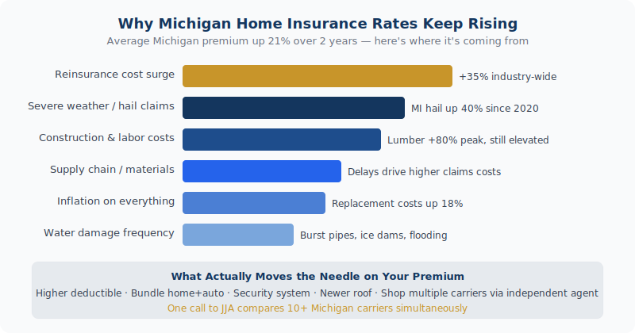

We can re-shop your Michigan homeowners policy across 20+ carriers. <a href="../../personal/home-insurance/" style="color:var(--navy);font-weight:600;">See if you can lower your home insurance rate →</a>

You didn't file a claim. You didn't move. Your house didn't change. So why is your insurance bill hundreds of dollars higher this year? Here's exactly what's driving Michigan home insurance rates up in 2026 — and what you can do right now to bring your premium back down.

<em>"I haven't filed a single claim in 12 years. I haven't touched my house. But somehow, my renewal notice is $230 more than last year. What is going on?"</em>

Sound familiar? Homeowners across Michigan are opening renewal notices and doing a double-take. Premiums have jumped an average of <strong>21% over the past two years</strong>, adding roughly $244 to the average annual bill. And 2026 isn't offering much relief, with rates projected to climb another <strong>8% this year</strong>.

The frustrating part? Most of this has nothing to do with anything you did. The forces driving these increases are happening well outside your front door. But here's the good news: once you understand why rates went up, you have real leverage to bring them back down.

<h2>By the Numbers: How Much Have Rates Gone Up?</h2>

<table style="width:100%;border-collapse:collapse;margin:1rem 0 1.5rem;font-size:.97rem;">
  <thead>
    <tr style="background:var(--bg-alt);text-align:left;">
      <th style="padding:.65rem 1rem;border:1px solid var(--border);color:var(--ink);">Metric</th>
      <th style="padding:.65rem 1rem;border:1px solid var(--border);color:var(--ink);">Figure</th>
    </tr>
  </thead>
  <tbody>
    <tr><td style="padding:.6rem 1rem;border:1px solid var(--border);">Average rate increase, last 2 years</td><td style="padding:.6rem 1rem;border:1px solid var(--border);font-weight:700;color:var(--ink);">+21%</td></tr>
    <tr style="background:var(--bg-alt);"><td style="padding:.6rem 1rem;border:1px solid var(--border);">Extra cost per year for avg. homeowner</td><td style="padding:.6rem 1rem;border:1px solid var(--border);font-weight:700;color:var(--ink);">+$244</td></tr>
    <tr><td style="padding:.6rem 1rem;border:1px solid var(--border);">Rise in avg. deductibles (2025)</td><td style="padding:.6rem 1rem;border:1px solid var(--border);font-weight:700;color:var(--ink);">+22%</td></tr>
    <tr style="background:var(--bg-alt);"><td style="padding:.6rem 1rem;border:1px solid var(--border);">More paid in claims than collected, 2024</td><td style="padding:.6rem 1rem;border:1px solid var(--border);font-weight:700;color:var(--ink);">$80 billion</td></tr>
  </tbody>
</table>

<h2>The Real Reasons Your Home Insurance Went Up</h2>

Insurance companies don't raise rates arbitrarily — they raise them because their costs are rising. In 2024 alone, U.S. property and casualty insurers paid out <strong>$80 billion more in claims than they collected in premiums</strong>. When that math breaks, everyone's bill goes up. Here's what's specifically driving those losses:

<h3>1. More Severe Weather — Including Right Here in Michigan</h3>

Wildfires, tornadoes, hail, and severe storms have become more frequent and more destructive. Severe convective storms — including the hail and windstorm events that hammer the Midwest — are now the <strong>top insurance peril in the country</strong>, surpassing hurricanes. Insured losses from these storms hit $42 billion by mid-2025 alone. When disasters multiply, premiums follow.

<h3>2. Construction Costs Are Still Elevated</h3>

To pay a claim, your insurer has to hire contractors and buy materials. Lumber, roofing, and skilled labor are all significantly more expensive than they were a few years ago. A construction labor shortage has driven up both repair timelines and costs — and those higher costs get baked directly into your premium.

<h3>3. Your Home's Rebuild Cost Has Gone Up</h3>

Insurance isn't about market value — it's about the <em>cost to rebuild</em> from scratch. As material and labor costs have risen, the amount it would take to reconstruct your home has jumped. Your insurer may have automatically adjusted your coverage limits to keep you properly protected — and that adjustment raises your premium, even if you didn't ask for it.

<h3>4. Reinsurance Costs Are Being Passed Down</h3>

Insurance companies buy their own insurance — called reinsurance — to protect against catastrophic losses. As disasters have become more expensive globally, reinsurance costs have surged. Those costs travel down the chain, right to your renewal notice.

<h3>5. Insurers Are Now Pricing Risk More Precisely</h3>

Carriers are increasingly using satellite imagery, drone inspections, and predictive analytics to evaluate property-specific risks. If your home is in a zip code with higher claim frequency — or if a roof inspection revealed wear — your rate may now reflect that more precisely than it did five years ago.

<strong>Michigan Note:</strong> Even if none of these factors seem personal to your situation, you may still be paying more simply because the entire insurance market has recalibrated. Industry-wide losses affect all policyholders — not just high-risk homeowners. Michigan's weather patterns (hail season, ice storms, flooding) make our state particularly exposed to these trends.

<h2>
<figure style="margin:1.5rem 0 2rem;"><figcaption style="font-size:.8rem;color:var(--text-muted);margin-top:.5rem;text-align:center;">Why Michigan home insurance premiums keep rising — the main cost drivers</figcaption></figure>
7 Ways to Actually Lower Your Homeowners Insurance Premium</h2>

Here's what your renewal notice doesn't tell you: you have more control than you think. These are legitimate strategies Michigan homeowners use every year to keep their premiums in check.

<h3>1. Bundle Your Home and Auto Policies</h3>

This is the single biggest discount most homeowners leave on the table. Bundling your home and auto insurance with the same carrier typically saves <strong>10–25% on both policies</strong>. If yours are currently with different companies, one call to our office lets us find you the best bundled rate across our carrier options simultaneously.

<h3>2. Raise Your Deductible</h3>

Bumping from a $500 to a $1,000 or $2,500 deductible can noticeably reduce your annual premium. The rule of thumb: only raise it to an amount you could realistically cover out of pocket if something happened tomorrow. You're essentially self-insuring for small claims and protecting yourself from the big ones.

<h3>3. Install Smart Home Safety Devices</h3>

Security systems, smoke detectors, and especially <em>water leak detection sensors</em> can earn you real discounts. Water damage is one of the most common and costly claims. Smart sensors that catch a pipe leak before it floods your basement are exactly the kind of risk mitigation insurers reward — sometimes with discounts up to 20%.

<h3>4. Update Your Roof — and Tell Your Insurer</h3>

A newer roof dramatically reduces your risk profile. If you've replaced yours in the last 5–10 years and haven't notified your insurer, call today — you may be overpaying right now. If you're planning a replacement, ask about <strong>impact-resistant materials</strong>. In Michigan, where hail is a real concern, this can unlock additional discounts with many carriers.

<h3>5. Call an Independent Agent — Let Us Shop for You</h3>

Here's the advantage of working with an independent agency like J. Jacobs &amp; Associates: you don't have to call around yourself. When your renewal comes in higher than expected, one call to our office lets us re-quote your home across more than 10 carefully selected carriers — simultaneously. We do the comparison work, present you the best options, and handle the switch if it makes sense.

That's something a captive agent (State Farm, Allstate, Farmers) simply can't offer — they can only show you one company's rate. Before you spend an afternoon on hold with multiple insurers, give us a call. It's free, and it's exactly what we do every day for Michigan homeowners.

<h3>6. Review Your Coverage Limits Annually</h3>

Are you still paying for coverage you no longer need? Did the trampoline come down? Did valuable jewelry get passed along to the kids? A quick annual policy audit can eliminate unnecessary coverage — and unnecessary cost. Thirty minutes with your agent can pay for itself many times over.

<h3>7. Ask About Every Available Discount</h3>

Many discounts go unclaimed simply because homeowners don't know to ask. Senior discounts, claim-free discounts, paperless billing, new homebuyer discounts, and loyalty rewards are all common — but not always automatically applied. At renewal, ask your agent to walk through the full discount list. You might be surprised what you've been missing.

<h2>Frequently Asked Questions</h2>

  
Why did my homeowners insurance go up even though I never filed a claim?

  

    
Your premium is shaped by industry-wide trends, not just your personal history. When natural disasters, construction costs, and reinsurance prices rise nationally, all homeowners see rate increases — even those with a spotless claims record. Your clean history does help (it likely keeps your rate from rising even more), but it can't fully offset market-wide pressures.

  

  
How much did the average homeowners insurance premium increase in 2026?

  

    
Home insurance rates are projected to increase approximately 8% on average in 2026. Over the past two years combined, rates have risen an average of 21%, adding roughly $244 per year to the typical homeowner's bill. Average deductibles also rose 22% in 2025.

  

  
Can I negotiate my homeowners insurance rate?

  

    
Not in the traditional sense, but you can absolutely influence it. Getting competing quotes gives you leverage. Home improvements like a new roof or security system qualify you for discounts. And simply asking your agent to audit your policy for every available discount often turns up savings that weren't being applied. Working with an independent agent who shops multiple carriers is the most powerful lever most homeowners have.

  

  
Will Michigan homeowners insurance rates go down anytime soon?

  

    
Some analysts are cautiously optimistic that the rate of increase will slow as new market capacity enters. However, a significant drop in premiums isn't widely expected in the near term given ongoing climate risks and elevated construction costs. The best strategy is to proactively manage your own policy — which is exactly what we help Michigan homeowners do.

  

  
Why use an independent insurance agency instead of going direct?

  

    
An independent agency like J. Jacobs &amp; Associates works for <em>you</em>, not for a single insurance company. We shop your coverage across multiple carriers at once and show you the best options — on price, coverage, and service reputation. A captive agent at State Farm or Allstate can only offer you their one company's rate. When rates are rising, having someone in your corner who can instantly compare 10+ options is a significant advantage.

  

  

<h3 style="font-size:1rem;text-transform:uppercase;letter-spacing:.06em;color:var(--text-muted);margin-bottom:1rem;">Related Articles</h3>
<a href="../michigan-homeowners-insurance-glossary/" style="display:block;padding:1rem;border:1px solid var(--border);border-radius:var(--r-md);text-decoration:none;color:inherit;transition:border-color .2s;">Insurance Education
Michigan Homeowners Insurance Terminology Guide
</a><a href="../michigan-flood-insurance/" style="display:block;padding:1rem;border:1px solid var(--border);border-radius:var(--r-md);text-decoration:none;color:inherit;transition:border-color .2s;">Home Insurance
Flood Insurance in Michigan: What Your Homeowners Policy Doesn't Cover
</a><a href="../michigan-umbrella-insurance-who-needs-it/" style="display:block;padding:1rem;border:1px solid var(--border);border-radius:var(--r-md);text-decoration:none;color:inherit;transition:border-color .2s;">Personal Insurance
Michigan Umbrella Insurance: Who Needs It and What It Actually Costs
</a>

