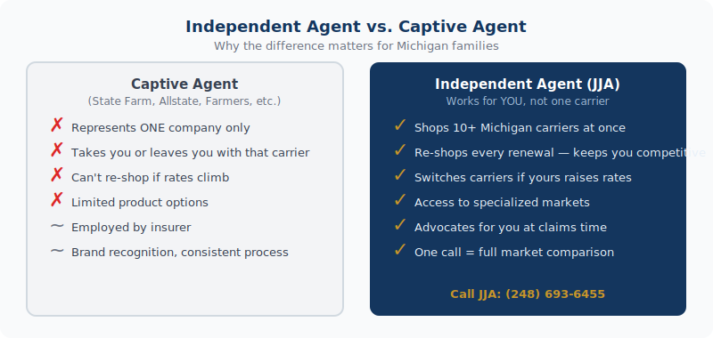

    <figure style="margin:0 0 2rem;border-radius:12px;overflow:hidden;"><picture><source srcset="../../assets/img/blog/photo-1526948531399-320e7e40f0ca.avif" type="image/avif"></picture></figure>
    

See how much you can save with one call to JJA Insurance. <a href="../../quotes/" style="color:var(--navy);font-weight:600;">Start a free Michigan insurance quote →</a>

Michigan auto insurance climbed <strong>12% in 2025</strong>. Home insurance jumped <strong>57%</strong> over the past year, pushing the state to 4th most expensive in the country for auto coverage. If you&#39;re getting your insurance from a captive agent — someone who works exclusively for one company like State Farm, Allstate, or Farmers — you&#39;re only seeing one number. Here&#39;s what you&#39;re missing, and why working with an independent agent changes the math entirely.

<strong>The core difference:</strong> A captive agent can only offer their company&#39;s rate. An independent agent like J. Jacobs &amp; Associates shops your coverage across multiple carriers simultaneously — then brings you the best combination of price, coverage, and carrier stability. One call. Multiple options. You pick.

<h2>
<figure style="margin:1.5rem 0 2rem;"><figcaption style="font-size:.8rem;color:var(--text-muted);margin-top:.5rem;text-align:center;">Independent insurance agent vs. captive agent — what's the difference?</figcaption></figure>
What a Captive Agent Is (And Isn&#39;t)</h2>

A captive agent works for one insurance company. When you call your State Farm agent, they run your information through State Farm&#39;s system and give you State Farm&#39;s rate. That&#39;s it. They can&#39;t compare it to what Progressive, Citizens, Frankenmuth, or Cincinnati Insurance would charge for the same coverage. They literally don&#39;t have access to those rates.

This isn&#39;t a knock on captive agents as people — many are experienced professionals. The limitation is structural. They&#39;re locked into one carrier&#39;s pricing, underwriting rules, and products. If that company&#39;s rates aren&#39;t competitive for your profile, you&#39;ll never know it from them.

<h2>What an Independent Agent Actually Does</h2>

An independent agent — sometimes called an independent broker — holds contracts with multiple insurance carriers. At J. Jacobs &amp; Associates, we carry appointments with approximately 10 personal lines carriers and 20 commercial lines carriers. When you call us for a quote, we run your information across those carriers at the same time and see where the best combination of price and coverage lands.

More importantly, we can explain the differences between those options. Not all $1 million umbrella policies are the same. Not all home policies treat water damage the same way. Not all auto policies handle diminished value claims the same way. We know the contract language, the claims reputations, and the carrier stability ratings — and we can walk you through the distinctions that actually matter.

<h2>Why This Matters More Right Now Than It Did Three Years Ago</h2>

Insurance pricing isn&#39;t static. Carriers constantly adjust their rates based on loss experience, reinsurance costs, and strategic decisions about which markets they want to be competitive in. A carrier that was the best rate for your profile in 2022 might not be in 2026 — and a different carrier that wasn&#39;t even competitive then might now be offering significantly better pricing.

With Michigan auto rates up 12% in a single year and home rates up 57% over the past 12 months, this isn&#39;t theoretical. Real households are seeing hundreds of dollars in increases at renewal. The spread between carriers on those same profiles has widened considerably. That spread is exactly where an independent agent earns their value.

<h3>A real-world illustration</h3>

A typical Michigan homeowner in 2025 might be paying $2,200 per year for home insurance with their current carrier. At renewal, that becomes $2,600 — a $400 jump with no claims and no changes. If that homeowner calls us, we re-quote across our carrier options. One carrier might come in at $2,050. Another at $1,950. The savings from making one phone call could be $550–$650 per year. Over five years, that&#39;s a meaningful number.

<strong>Important:</strong> We don&#39;t charge for this. There&#39;s no fee to get a comparison quote from us. Independent agents are compensated by the carriers — not by charging clients for the shopping service. You&#39;re getting a full market comparison at no cost to you.

<h2>The Loyalty Trap — And Why You Shouldn&#39;t Fall Into It</h2>

Many Michigan households have been with the same insurance company for 10, 15, or 20 years. There&#39;s comfort in that familiarity — you know your agent, you know the company&#39;s name. But loyalty doesn&#39;t always translate to competitive pricing.

In fact, some carriers use what the industry calls "price optimization" — gradually increasing rates for long-tenured customers who are unlikely to shop because they assume loyalty is being rewarded. In reality, new customers at those same companies are often getting better rates than people who&#39;ve been there for years.

The antidote is simple: review your coverage with an independent agent every one to two years. You&#39;re not obligated to switch. But knowing your current rate is competitive — or discovering it isn&#39;t — is valuable either way.

<h2>Independent vs. Captive: The Real Comparison</h2>

<table style="width:100%;border-collapse:collapse;margin:1rem 0 1.5rem;font-size:.97rem;">
  <thead>
    <tr style="background:var(--bg-alt);text-align:left;">
      <th style="padding:.65rem 1rem;border:1px solid var(--border);color:var(--ink);"></th>
      <th style="padding:.65rem 1rem;border:1px solid var(--border);color:var(--ink);">Independent Agent (JJA)</th>
      <th style="padding:.65rem 1rem;border:1px solid var(--border);color:var(--ink);">Captive Agent</th>
    </tr>
  </thead>
  <tbody>
    <tr><td style="padding:.6rem 1rem;border:1px solid var(--border);">Carriers available</td><td style="padding:.6rem 1rem;border:1px solid var(--border);font-weight:700;color:var(--navy);">10–20+</td><td style="padding:.6rem 1rem;border:1px solid var(--border);">1</td></tr>
    <tr style="background:var(--bg-alt);"><td style="padding:.6rem 1rem;border:1px solid var(--border);">Can shop your rate at renewal</td><td style="padding:.6rem 1rem;border:1px solid var(--border);font-weight:700;color:var(--navy);">Yes</td><td style="padding:.6rem 1rem;border:1px solid var(--border);">No</td></tr>
    <tr><td style="padding:.6rem 1rem;border:1px solid var(--border);">Works for you or the carrier</td><td style="padding:.6rem 1rem;border:1px solid var(--border);font-weight:700;color:var(--navy);">You</td><td style="padding:.6rem 1rem;border:1px solid var(--border);">The carrier</td></tr>
    <tr style="background:var(--bg-alt);"><td style="padding:.6rem 1rem;border:1px solid var(--border);">Can move you if rates rise</td><td style="padding:.6rem 1rem;border:1px solid var(--border);font-weight:700;color:var(--navy);">Yes</td><td style="padding:.6rem 1rem;border:1px solid var(--border);">No</td></tr>
    <tr><td style="padding:.6rem 1rem;border:1px solid var(--border);">Cost to get a comparison quote</td><td style="padding:.6rem 1rem;border:1px solid var(--border);font-weight:700;color:var(--navy);">Free</td><td style="padding:.6rem 1rem;border:1px solid var(--border);">N/A (one rate only)</td></tr>
  </tbody>
</table>

<h2>Why 25 Years in Michigan Matters</h2>

J. Jacobs &amp; Associates has been serving Michigan families and businesses for <strong>45 years</strong>. That tenure means something beyond the years on a sign. It means we know which carriers handle claims quickly and fairly in Michigan. We know which ones have raised rates aggressively in recent years and which have stayed competitive. We know the nuances of Michigan no-fault law, the quirks of Michigan weather exposure, and the carriers who&#39;ve earned loyal clients versus those who&#39;ve disappointed them.

The Lake Orion area is our community — we&#39;ve been named Best of the Best by Lake Orion Review readers eight consecutive years. That recognition comes from the same principle: we work for our clients, not for a single insurance company. When one carrier stops being the best option for someone we&#39;ve insured for 15 years, we move their coverage. That&#39;s what independence means in practice.

<h2>Frequently Asked Questions</h2>

  
Is an independent agent more expensive than going direct to a carrier?

  

    
No — and often the opposite is true. Independent agents are compensated by the carriers through commissions built into the premium structure. You don&#39;t pay extra to work with us versus buying direct. And because we shop multiple carriers, we regularly find rates lower than what a single company would quote you directly. The comparison shopping is free, and it frequently produces meaningfully better pricing.

  

  
What happens to my coverage if JJA can&#39;t find a better rate?

  

    
We tell you. If your current carrier is competitive and there&#39;s no compelling reason to move, we&#39;ll say so. Our goal isn&#39;t to churn policies — it&#39;s to make sure you&#39;re well covered at a fair price. Sometimes the answer after a full market search is that you&#39;re already in the right place. You&#39;ll know that for certain rather than just assuming it.

  

  
Can an independent agent help me if my carrier drops me?

  

    
Absolutely — this is one of the most valuable times to have an independent agent. If your carrier nonrenews your policy, a captive agent from that company can&#39;t help you at all. We can immediately search our full carrier network for coverage, including specialty markets for higher-risk properties or situations. Getting dropped doesn&#39;t mean you&#39;re uninsurable — it means you need someone who can access more of the market.

  

  
How often should I have my insurance reviewed?

  

    
Every one to two years, or any time there&#39;s a meaningful change — new vehicle, home purchase or renovation, new teen driver, marriage, retirement, starting a business, adding a pool. Life changes affect your coverage needs and your risk profile. A brief annual check-in takes 15 minutes and can reveal both coverage gaps and unnecessary costs. We do this proactively for our clients.

  

  
Why is Michigan auto insurance so expensive compared to other states?

  

    
Several factors: Michigan&#39;s no-fault insurance system historically required unlimited lifetime medical coverage (PIP), which drove up base rates significantly. The 2019 reforms gave drivers more choices on PIP limits, which has helped, but the overall system still carries higher costs than most states. Urban density in Metro Detroit, a high number of uninsured drivers, and litigation rates also contribute. Working with an independent agent won&#39;t change Michigan&#39;s market dynamics, but it does ensure you&#39;re finding the most competitive rate available within them.

  

  

<h3 style="font-size:1rem;text-transform:uppercase;letter-spacing:.06em;color:var(--text-muted);margin-bottom:1rem;">Related Articles</h3>
<a href="../michigan-auto-insurance-glossary/" style="display:block;padding:1rem;border:1px solid var(--border);border-radius:var(--r-md);text-decoration:none;color:inherit;transition:border-color .2s;">Insurance Education
Michigan Auto Insurance Terminology Guide
</a><a href="../why-home-insurance-went-up-2026/" style="display:block;padding:1rem;border:1px solid var(--border);border-radius:var(--r-md);text-decoration:none;color:inherit;transition:border-color .2s;">Home Insurance
Why Did My Homeowners Insurance Go Up in 2026? (And 7 Ways to Fight Back)
</a><a href="../michigan-umbrella-insurance-who-needs-it/" style="display:block;padding:1rem;border:1px solid var(--border);border-radius:var(--r-md);text-decoration:none;color:inherit;transition:border-color .2s;">Personal Insurance
Michigan Umbrella Insurance: Who Needs It and What It Actually Costs
</a>

